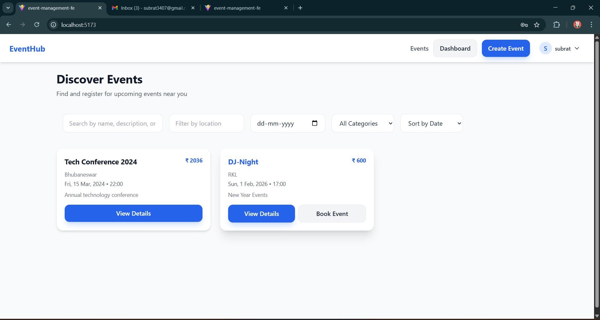
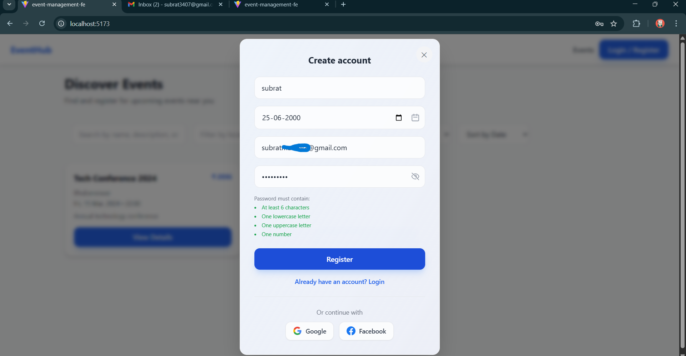
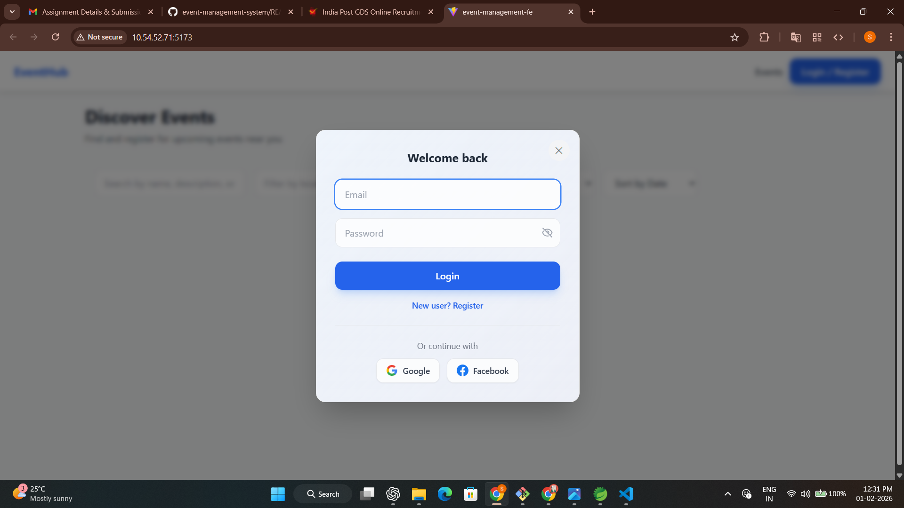
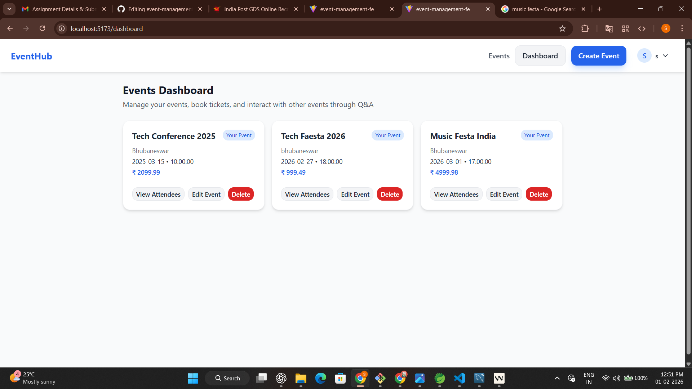
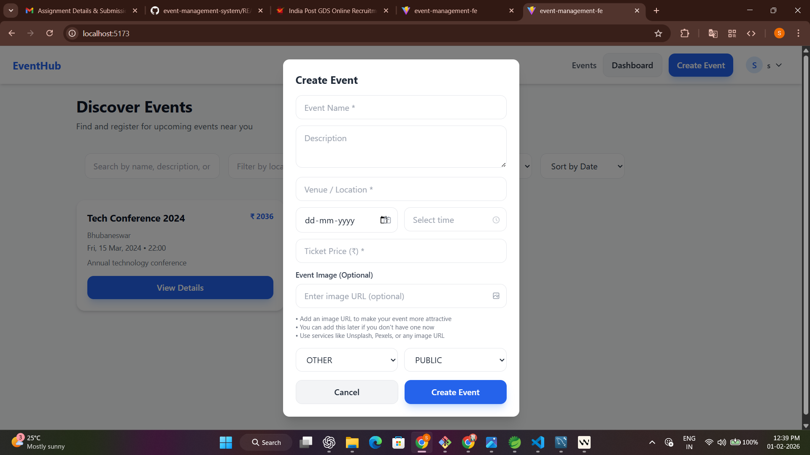
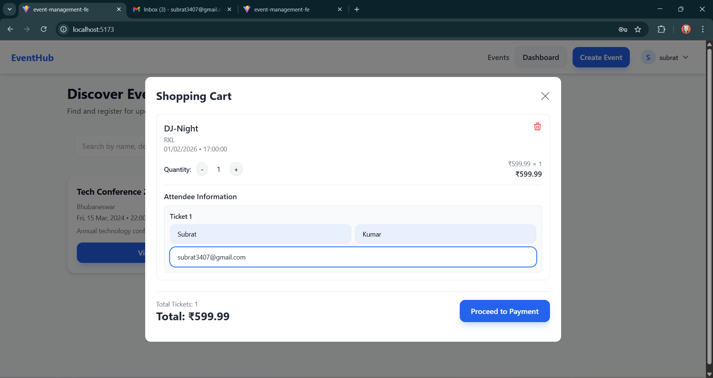

# 🎉 Event Management System

A **full‑stack Event Management System** built with **React.js (Frontend)** and **Spring Boot (Backend)**, designed to manage events, users, and bookings in a structured and scalable way.

> **Note:** `fe` stands for **Frontend**, which is developed using **React.js**.

---

## 📌 Project Description

The **Event Management System** is a web application that allows users to:

* Browse and manage events
* Register and authenticate users
* Create, update, and delete events (admin/organizer)
* Manage event-related data using a relational database (MySQL)

The project follows a **modern full‑stack architecture**:

* A **React.js frontend** for a fast and interactive UI
* A **Spring Boot REST API backend** for business logic and data handling
* **MySQL** as the database

This project is suitable for:

* College final‑year projects
* Portfolio showcasing
* Learning full‑stack development (React + Spring Boot)

---

## 🏗️ Full Project Structure

### 📁 Detailed Folder Structure

```
event-management-system/
│
├── event-management-fe/                 # Frontend (React.js)
│   ├── public/
│   │   ├── index.html
│   │   └── _redirects
│   ├── src/
│   │   ├── assets/
│   │   ├── components/
│   │   ├── pages/
│   │   ├── services/
│   │   │   └── api.js
│   │   ├── App.jsx
│   │   ├── main.jsx
│   │   └── index.css
│   ├── .env.example
│   ├── package.json
│   ├── vite.config.js
│   └── README.md
│
├── event-management-backend/            # Backend (Spring Boot)
│   ├── src/
│   │   ├── main/
│   │   │   ├── java/
│   │   │   │   └── com/example/eventmanagement/
│   │   │   │       ├── controller/
│   │   │   │       ├── service/
│   │   │   │       ├── repository/
│   │   │   │       ├── model/
│   │   │   │       ├── config/
│   │   │   │       └── EventManagementApplication.java
│   │   │   └── resources/
│   │   │       ├── application.properties
│   │   │       └── static/
│   │   └── test/
│   ├── pom.xml
│   ├── mvnw
│   └── mvnw.cmd
│
├── .gitignore
├── README.md
└── LICENSE
```

---

## 🛠️ Tech Stack

### Frontend (FE)

* **React.js**
* **Vite**
* **Tailwind CSS**
* **Axios**

### Backend

* **Spring Boot**
* **Spring Data JPA**
* **REST APIs**
* **Maven**

### Database

* **MySQL**

---

## ⚙️ Environment Variables

### Frontend (`event-management-fe/.env`)

```env
VITE_API_BASE_URL=http://localhost:8080
```

### Backend (`application.properties`)

```properties
server.port=8080

spring.datasource.url=jdbc:mysql://localhost:3306/event_db
spring.datasource.username=root
spring.datasource.password=yourpassword

spring.jpa.hibernate.ddl-auto=update
spring.jpa.database-platform=org.hibernate.dialect.MySQL8Dialect
```

---

## ▶️ How to Run the Project Locally

### 1️⃣ Backend (Spring Boot)

```bash
cd event-management-backend
./mvnw spring-boot:run
```

Backend will run at:

```
http://localhost:8080
```

---

### 2️⃣ Frontend (React)

```bash
cd event-management-fe
npm install
npm run dev
```

Frontend will run at:

```
http://localhost:5173
```

---

## 🚀 Deployment (Free Hosting)

### Frontend

* Hosted on **Cloudflare Pages**

### Backend

* Hosted on **Render**

### Database

* MySQL (Cloud / Managed MySQL)

---

## 🌍 Live Project Links

> These links will be updated after deployment

* **Frontend Live URL:** ⏳ *Coming Soon*
* **Backend API URL:** ⏳ *Coming Soon*

---

## 🔗 API Endpoints

### 🔐 Authentication

| Method | Endpoint           | Description       |
| ------ | ------------------ | ----------------- |
| POST   | /api/auth/register | Register new user |
| POST   | /api/auth/login    | User login        |

### 📅 Events

| Method | Endpoint         | Description      |
| ------ | ---------------- | ---------------- |
| GET    | /api/events      | Get all events   |
| GET    | /api/events/{id} | Get event by ID  |
| POST   | /api/events      | Create new event |
| PUT    | /api/events/{id} | Update event     |
| DELETE | /api/events/{id} | Delete event     |

---

## 🖼️ UI Preview / Screenshots

### 🏠 Home Page


### 🔐 Registration Page


### 🔐 Login Page


### 📊 Dashboard


### ➕ Create Event


### ➕ Book Event


*Add screenshots by creating a `screenshots` folder in the root directory and updating this section.*

---

## 🚀 Deployment Guide (Free Hosting)

### 🔹 Frontend Deployment (Cloudflare Pages)

1. Push frontend code to GitHub
2. Login to Cloudflare Pages
3. Create a new project and connect the repository
4. Set build command: `npm run build`
5. Set output directory: `build`
6. Add environment variable:

   ```
   VITE_API_BASE_URL=https://your-backend-url
   ```

### 🔹 Backend Deployment (Render)

1. Push backend code to GitHub
2. Create a new Web Service on Render
3. Select Java runtime
4. Build command:

   ```bash
   ./mvnw clean package
   ```
5. Start command:

   ```bash
   java -jar target/*.jar
   ```
6. Add environment variables for MySQL connection

---

## 🌍 Live Deployment URLs

* **Frontend (React):** [https://your-frontend.pages.dev](https://your-frontend.pages.dev)
* **Backend (Spring Boot API):** [https://your-backend.onrender.com](https://your-backend.onrender.com)

---

## ✨ Key Features

## 🧑‍💻 Author

**Subrat**
GitHub: [https://github.com/Subrat0007s](https://github.com/Subrat0007s)

---

## 📄 License

This project is for **educational and learning purposes**.

---

⭐ If you like this project, don’t forget to **star the repository**!
